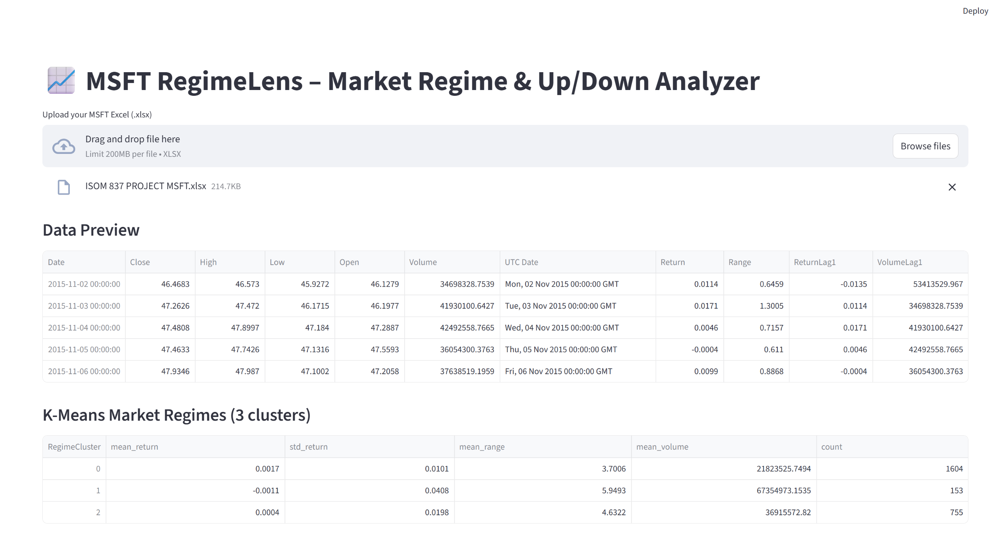
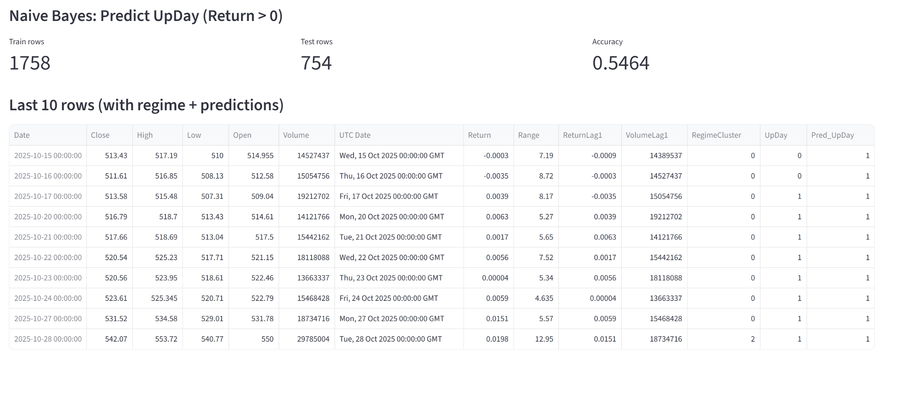

# MSFT RegimeLens – Market Regime & Up/Down Analyzer

## Live Demo
 https://regimelens-msft-7af59xh4e47pdvdlqwfbx4.streamlit.app/
## Demo Video (Loom)
 https://www.loom.com/share/8f1095ebfc3e4823aee34cee994ed6db

---

## Project Overview
This Streamlit application analyzes Microsoft (MSFT) stock data to:

- Identify **market regimes** using K-Means clustering
- Predict whether the **next trading day is Up or Down** using Naive Bayes
- Provide an interactive, end-to-end analytics pipeline

Users upload an Excel file containing MSFT price data, and the app automatically computes features, clusters regimes, and displays predictions.

---

## How It Works

### 1. Feature Engineering
- Daily Return
- Intraday Range (High − Low)
- Lagged Return
- Lagged Volume

### 2. Market Regimes (K-Means)
- Clusters trading days into **3 regimes**
- Each regime is summarized by:
  - Mean return
  - Volatility
  - Trading range
  - Volume

### 3. Direction Prediction (Naive Bayes)
- Target variable: `UpDay = Return > 0`
- Train/Test split
- Outputs model accuracy and predictions

---

## Screenshots

### Upload & Data Preview


### Regimes & Predictions


---

## How to Run Locally
```bash
pip install -r requirements.txt
streamlit run app.py
